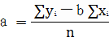

# 管理会计应用指引第303号——变动成本法

> **关于印发《管理会计应用指引第100号 ——战略管理》等22项管理会计应用指引的通知**
>
> 财会〔2017〕24号
>
> 党中央有关部门，国务院各部委、各直属机构，全国人大常委会办公厅，全国政协办公厅，高法院，高检院，各省、自治区、直辖市、计划单列市财政厅（局），新疆生产建设兵团财务局，财政部驻各省、自治区、直辖市、计划单列市财政监察专员办事处：
>
> 　　为促进企业加强管理会计工作，提升内部管理水平，促进经济转型升级，根据《管理会计基本指引》，我部制定了《管理会计应用指引第100号——战略管理》等首批22项管理会计应用指引，现予印发，请各单位在开展管理会计工作中参照执行。
>
> 　　附件：1. 管理会计应用指引第100-101号—战略管理相关应用指引
>
> 　　2. 管理会计应用指引第200-201号—预算管理相关应用指引
>
> 　　3．管理会计应用指引第300-304号—成本管理相关应用指引
>
> 　　4．管理会计应用指引第400-403号—营运管理相关应用指引
>
> 　　5．管理会计应用指引第500-502号—投融资管理相关应用指引
>
> 　　6．管理会计应用指引第600-603号—绩效管理相关应用指引
>
> 　　7．管理会计应用指引第801号—企业管理会计报告应用指引
>
> 　　8．管理会计应用指引第802号—管理会计信息系统应用指引
>
> 　　
>
> 财 政 部
>
> 2017年9月29日

--------------------


## 第一章 总 则

第一条 变动成本法，是指企业以成本性态分析为前提条件，仅将生产过程中消耗的变动生产成本作为产品成本的构成内容，而将固定生产成本和非生产成本作为期间成本，直接由当期收益予以补偿的一种成本管理方法。 

成本性态，是指成本与业务量之间的相互依存关系。按照成本性态，成本可划分为固定成本、变动成本和混合成本。 

固定成本，是指在一定范围内，其总额不随业务量变动而增减变动，但单位成本随业务量增加而相对减少的成本。 

变动成本，是指在一定范围内，其总额随业务量变动发生相应的正比例变动，而单位成本保持不变的成本。 

混合成本，是指总额随业务量变动但不成正比例变动的成本。 

第二条 变动成本法通常用于分析各种产品的盈利能力，为正确制定经营决策、科学进行成本计划、成本控制和成本评价与考核等工作提供有用信息。 

第三条 变动成本法一般适用于同时具备以下特征的企业：

（一）企业固定成本比重较大，当产品更新换代的速度较快时， 分摊计入产品成本中的固定成本比重大，采用变动成本法可以正确反映产品盈利状况； 

（二）企业规模大，产品或服务的种类多，固定成本分摊存在较大困难；

（三）企业作业保持相对稳定。 

## 第二章 应用环境

第四条 企业应用变动成本法，应遵循[《管理会计应用指引第 300 号——成本管理》 ](300.md) 中对应用环境的一般要求。

第五条 企业应用变动成本法所处的外部环境，一般应具备以下特点： 

（一）市场竞争环境激烈，需要频繁进行短期经营决策。 

（二）市场相对稳定，产品差异化程度不大，以利于企业进行价格等短期决策。

第六条 企业应保证成本基础信息记录完整，财务会计核算基础工作完善。

第七条 企业应建立较好的成本性态分析基础，具有划分固定成本与变动成本的科学标准，以及划分标准的使用流程与规范。

第八条 企业能够及时、全面、准确地收集与提供有关产量、成本、利润以及成本性态等方面的信息。

## 第三章 应用程序

第九条 企业应用变动成本法，一般按照成本性态分析、变动成本计算、损益计算等程序进行。

第十条 成本性态分析，是指企业基于成本与业务量之间的关系， 运用技术方法，将业务范围内发生的成本分解为固定成本和变动成本的过程。 

第十一条 混合成本的分解方法主要包括：高低点法、回归分析法、账户分析法（也称会计分析法）、技术测定法（也称工业工程法）、合同确认法，前两种方法需要借助数学方法进行分解，后三种方法可通过直接分析认定。 

（一）高低点法：企业以过去某一会计期间的总成本和业务量资料为依据，从中选取业务量最高点和业务量最低点，将总成本进行分解，得出成本模型。计算公式如下： 


固定成本总额＝最高点业务量的成本－单位变动成本×最高点业务量

或：＝最低点业务量的成本－单位变动成本×最低点业务量

高低点法计算较为简单，但结果代表性较差。 

（二）回归分析法：企业根据过去一定期间的业务量和混合成本的历史资料，应用最小二乘法原理，计算最能代表业务量与混合成本关系的回归直线，借以确定混合成本中固定成本和变动成本的方法。

计算公式如下： 

假设混合成本符合总成本模型，即：Y=a+bX 式中：a 为固定成本部分；b 为单位变动成本。




回归分析法的结果较为精确，但计算较为复杂。

（三）账户分析法：企业根据有关成本账户及其明细账的内容， 结合其与产量的依存关系，判断其比较接近的成本类别，将其视为该类成本。 

账户分析法较为简便易行，但比较粗糙且带有主观判断。  

（四）技术测定法：企业根据生产过程中各种材料和人工成本消耗量的技术测定来划分固定成本和变动成本。

技术测定法仅适用于投入成本和产出数量之间有规律性联系的成本分解。 

（五）合同确认法：企业根据订立的经济合同或协议中关于支付费用的规定，来确认并估算哪些项目属于变动成本，哪些项目属于固定成本。 

合同确认法一般要配合账户分析法使用。  

第十二条 在变动成本法下，为加强短期经营决策，按照成本性态，企业的生产成本分为变动生产成本和固定生产成本，非生产成本分为变动非生产成本和固定非生产成本。其中，只有变动生产成本才构成产品成本，其随产品实体的流动而流动，随产量变动而变动。 

第十三条 在变动成本法下，利润的计算通常采用贡献式损益表。

该表一般应包括营业收入、变动成本、边际贡献、固定成本、利润等项目。其中，变动成本包括变动生产成本和变动非生产成本两部分， 固定成本包括固定生产成本和固定非生产成本两部分。贡献式损益表中损益计算包括以下两个步骤： 

（一）计算边际贡献总额；  

```
边际贡献总额＝营业收入总额－变动成本总额 

​                       ＝销售单价×销售量－单位变动成本×销售量

​                       ＝（销售单价－单位变动成本）×销售量

​                       ＝单位边际贡献×销售量
```

 （二）计算当期利润。 

```
 利润＝边际贡献总额－固定成本总额 
```


## 第四章 工具方法评价

 第十四条 变动成本法的主要优点是：一是区分固定成本与变动成本，有利于明确企业产品盈利能力和划分成本责任；二是保持利润与销售量增减相一致，促进以销定产；三是揭示了销售量、成本和利润之间的依存关系，使当期利润真正反映企业经营状况，有利于企业经营预测和决策。 

第十五条 变动成本法的主要缺点是：一是计算的单位成本并不是完全成本，不能反映产品生产过程中发生的全部耗费；二是不能适应长期决策的需要。 

## 第五章 附 则

第十六条 本指引由财政部负责解释。
