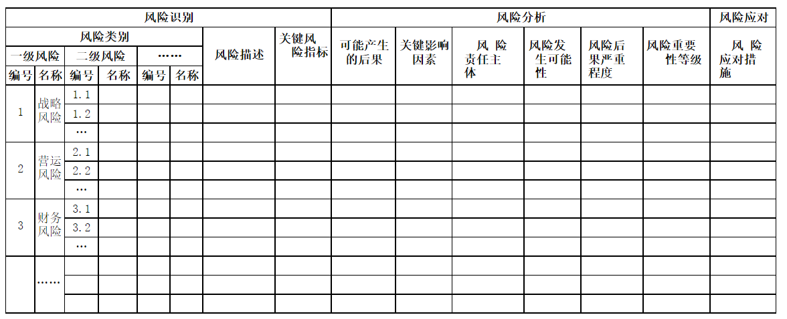
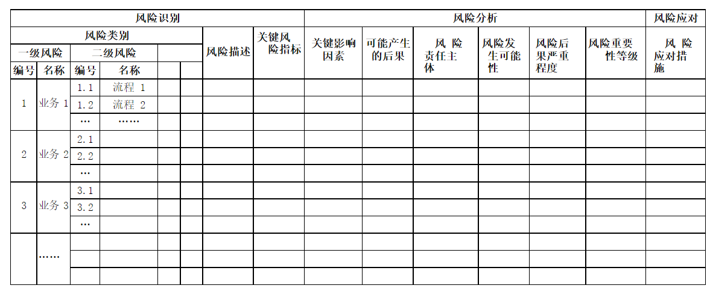

# 管理会计应用指引第 702 号——风险清单

 > 
<b>关于印发《管理会计应用指引第204号——作业预算》等5项 管理会计应用指引的通知</b>

 >
 > 财会〔2018〕38号
 >
 > 党中央有关部门，国务院各部委、各直属机构，全国人大常委会办公厅，全国政协办公厅，高法院，高检院，各省、自治区、直辖市、计划单列市财政厅（局），新疆生产建设兵团财政局，财政部驻各省、自治区、直辖市、计划单列市财政监察专员办事处：
 >
 > 　　为促进企业加强管理会计工作，提升内部管理水平，促进经济转型升级，根据《管理会计基本指引》，我部制定了《管理会计应用指引第204号——作业预算》等第三批5项管理会计应用指引，现予印发，请各单位在开展管理会计工作中参照执行。
 >
 > 　　附件：1.《管理会计应用指引第204号——作业预算》
 >
 > 　　2.《管理会计应用指引第404号——内部转移定价》
 >
 > 　　3.《管理会计应用指引第405号——多维度盈利能力分析》
 >
 > 　　4.《管理会计应用指引第702号——风险清单》
 >
 > 　　5.《管理会计应用指引第803号——行政事业单位》
 >
 > 
 >
 > 　　财 政 部
 >
 > 　　2018年12月27日
 >

--------------------------

 

 

 

<b>管理会计应用指引第 702 号——风险清单</b>

   

## 第一章 总 则

 

第一条 风险清单，是指企业根据自身战略、业务特点和风险管理要求，以表单形式进行风险识别、风险分析、风险应对措施、风险报告和沟通等管理活动的工具方法。

第二条 风险清单适用于各类企业及企业内部各个层级和各类型风险的管理。

第三条 企业应用风险清单工具方法的主要目标，是使企业从整体上了解自身风险概况和存在的重大风险，明晰各相关部门的风险管理责任，规范风险管理流程,并为企业构建风险预警和风险考评机制奠定基础。 

 

## 第二章 应用环境

 第四条 企业应用风险清单工具方法，应遵循《管理会计应用指引第 700 号——风险管理》中对应用环境的一般要求。

第五条 风险清单应由企业风险管理部门牵头组织实施，明确风险清单编制的对象和流程，建立培训、指导、协调、考核和监督机制。各部门对与本部门相关的风险清单的有效性负直接责任，有效性包括风险清单使用的效率和效果等。 

 

## 第三章 应用程序

 第六条 企业应用风险清单工具方法，一般按照编制风险清单、沟通与报告、评价与优化等程序进行。

第七条 企业一般按企业整体和部门两个层级编制风险清单。企业整体风险清单的编制一般按照构建风险清单基本框架、识别风险、分析风险、制定重大风险应对措施等程序进行；部门风险清单的编制可根据企业整体风险清单，梳理出与本部门相关的重大风险，依照上述流程进行。

中小企业编制风险清单，也可不区分企业整体和部门。

第八条 企业风险清单基本框架（见附录）一般包括风险识别、风险分析、风险应对三部分。风险识别部分主要包括风险类别、风险描述、关键风险指标等要素；风险分析部分主要包括可能产生的后果、关键影响因素、风险责任主体（以下简称“责任主体”）、风险发生可能性、风险后果严重程度、风险重要性等级等要素；风险应对部分主要包括风险应对措施等要素。企业构建风险清单基本框架时，可根据管理需要，对风险识别、风险分析、风险应对中的要素进行调整。

第九条 风险管理部门应从全局角度识别可能影响风险管理目标实现的因素和事项，建立风险信息库，在各相关部门的配合下共同识别风险。风险识别过程应遵循全面系统梳理、全员参与、动态调整的原则，对识别出的风险进行详细描述，明确关键风险指标等。

第十条 风险管理部门应对识别出的风险进行归类、编号，根据风险性质、风险指标是否可以量化等进行归类，并以此为基础填制完成风险清单基本框架中风险类别、风险描述、关键风险指标等要素。

第十一条 风险管理部门应根据已填列的风险识别部分的内容， 在与相关部门沟通后，分析各类风险可能产生的后果，确定引起该后果的关键影响因素及责任主体，并填制完成风险清单基本框架中可能产生后果、关键影响因素、风险责任主体等要素。

第十二条 各责任主体可基于风险偏好和风险应对能力，逐项分析风险清单中各类风险发生的可能性和后果严重程度，确定风险重要性等级，并填制风险发生可能性、风险后果严重程度、风险重要性等级等要素。风险重要性等级的确定方法和标准可参见《管理会计应用指引第 701 号——风险矩阵》。

第十三条 风险管理部门应以风险重要性等级结果为依据确定企业整体的重大风险，报企业风险管理决策机构批准后反馈给相关责任主体。

第十四条 风险管理部门应会同各责任主体结合企业的风险偏好、风险管理能力等制定相应的风险管理应对措施，填制风险清单基本框 架中风险应对措施要素，由此填制完成企业整体风险清单。

第十五条 风险管理部门及各责任主体可对企业整体重大风险进行进一步的分析，也可直接对各部门相关的业务流程进行细化分解， 形成相关部门的风险清单。

各部门应用本风险清单进行风险管理的程序与企业整体风险清单类似，但应加强流程细节分析，突出具体应对措施，力求将风险管理切实落到业务流程和岗位责任人。 

第十六条 风险管理部门应将风险清单所呈现的风险信息及时传递给相关责任主体，确保各责任主体准确理解相关的风险信息，有效开展风险管理活动。为提高风险清单应用的有效性，风险管理部门可将其纳入企业风险管理报告。

第十七条 风险管理部门应会同各责任主体定期或不定期地根据企业内外部环境变化，对风险清单是否全面识别风险并准确分类、是否准确分析风险成因及后果、是否采取了恰当的风险应对措施等进行评估，及时对风险清单进行更新调整。

  

## 第四章 工具方法评价

 第十八条 风险清单的主要优点：能够直观反映企业风险情况， 易于操作，能够适应不同类型企业、不同层次风险、不同风险管理水平的风险管理工作。

第十九条 风险清单的主要缺点：风险清单所列举的风险往往难以穷尽，且风险重要性等级的确定可能因评价的主观性而产生偏差。

  

## 第五章 附 则

第二十条 本指引由财政部负责解释。

 

 

## 附录 1：企业整体风险清单

 

 

 

## 附录 2：部门风险清单

 

 