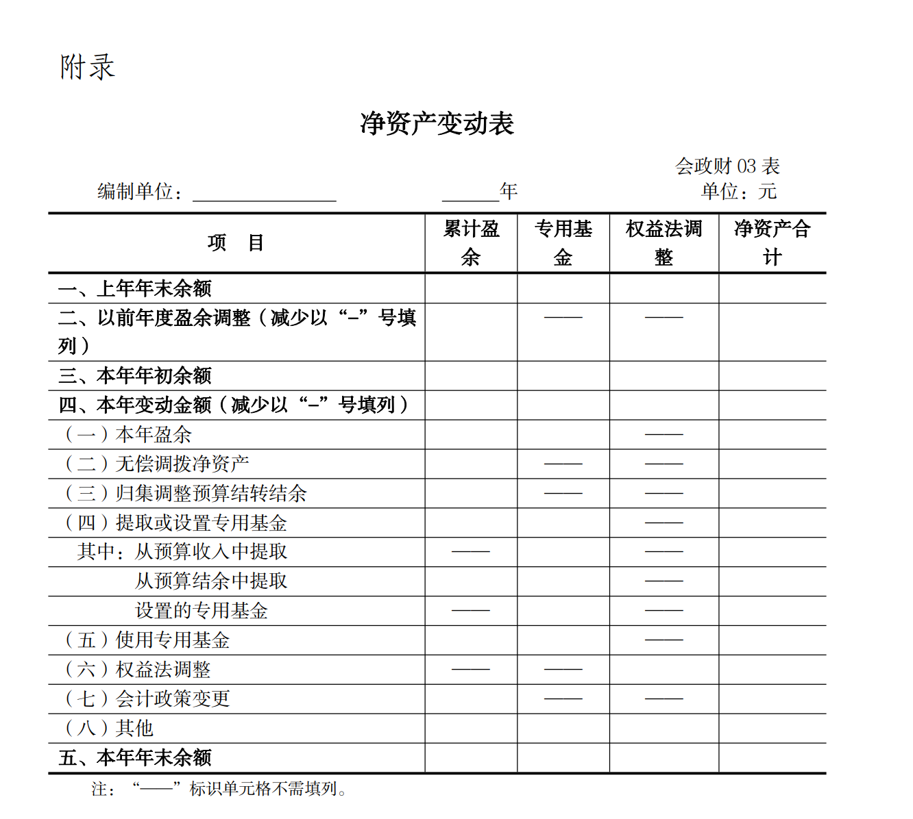

# 政府会计准则制度解释第6号

> **关于印发《政府会计准则制度解释第6号》的通知**
> **财会〔2023〕18号**
>
> 有关中央预算单位，各省、自治区、直辖市、计划单列市财政厅（局），新疆生产建设兵团财政局：
>
> 为了进一步健全和完善政府会计准则制度，确保政府会计准则制度有效实施，根据《政府会计准则——基本准则》（财政部令第78号），我们制定了《政府会计准则制度解释第6号》，现予印发，请遵照执行。
>
> 执行中如有问题，请及时反馈我部。
>
> 附件：政府会计准则制度解释第6号
>
> ​															财政部
> ​															2023年10月20日

------------------------------

# 一、关于固定资产的明细核算

根据《固定资产等资产基础分类与代码》（GB/T 14885-2022），行政事业单位（以下简称单位）应当自本解释施行之日起，在《政府会计制度——行政事业单位会计科目和报表》（财会〔2017〕25号，以下简称《政府会计制度》）中“固定资产”、“固定资产累计折旧”科目下按照固定资产类别设置“房屋和构筑物”、“设备”、“文物和陈列品”、“图书和档案”、“家具和用具”、“特种动植物”明细科目。

同时，单位应当将“固定资产”科目和对应的“固定资产累计折旧”科目原相关明细科目余额（如有）按以下规定转入新的明细科目：

1.原“房屋及构筑物”明细科目的余额，按照所属资产类别分别转入“房屋和构筑物”、“设备”、“家具和用具”明细科目；

2.原“专用设备”、“通用设备”明细科目的余额转入“设备”明细科目；

3.原“图书、档案”明细科目的余额转入“图书和档案”明细科目；

4.原“家具、用具、装具及动植物”明细科目中属于家具、用具、装具的资产余额转入“家具和用具”明细科目；

5.原“家具、用具、装具及动植物”明细科目中属于动植物的资产余额转入“特种动植物”明细科目。

# 二、关于工程项目专门借款利息的会计处理

单位为购建固定资产等工程项目借入专门借款的，属于工程项目建设期间发生的利息费用，应当计入工程成本，在财务会计借记“在建工程——待摊投资”科目，贷记“应付利息”或“长期借款——应计利息”科目；属于工程项目建设期间尚未动用的借款资金产生的归属于单位的利息收入，应当冲减工程成本，在财务会计借记“银行存款”等科目，贷记“在建工程——待摊投资”科目。

专门借款不属于工程项目建设期间发生的利息费用，应当计入当期费用，在财务会计借记“其他费用”科目，贷记“应付利息”或“长期借款——应计利息”科目；不属于工程项目建设期间尚未动用的借款资金产生的归属于单位的利息收入，应当计入当期收入，在财务会计借记“银行存款”等科目，贷记“利息收入”科目。

单位应当在实际支付专门借款利息支出、收到尚未动用的借款资金产生的归属于单位的利息收入时，按照《政府会计制度》相关规定进行预算会计处理。

工程项目建设期间的确定，应当遵循《政府会计准则第8号——负债》（财会〔2018〕31号）的规定。

# 三、关于以前年度社会保险费结算的会计处理

单位因养老保险制度改革实施准备期清算、养老保险缴费比例调整等原因导致调整以前年度应缴社会保险费（如职工基本养老保险费、职业年金等）的，对属于单位缴费的部分应区分以下情况进行会计处理：

（一）社会保险经办机构轧差退回以前年度缴费的情况。

单位应当在财务会计借记“银行存款”、“财政应返还额度”等科目，贷记“以前年度盈余调整”等科目；在预算会计借记“资金结存”科目，贷记有关结转结余科目下的“年初余额调整”明细科目。

有关资金需缴回财政或注销财政拨款结转结余资金额度的，应当按照《政府会计制度》相关规定进行会计处理。

（二）社会保险经办机构轧差补收以前年度缴费的情况。

在确定补缴金额时，单位应当在财务会计借记“以前年度盈余调整”等科目，贷记“应付职工薪酬——社会保险费”科目。

在实际补缴时，单位应当在财务会计借记“应付职工薪酬——社会保险费”科目，贷记“银行存款”、“财政应返还额度”、“财政拨款收入”等科目；在预算会计借记“行政支出”、“事业支出”等科目，贷记“资金结存”、“财政拨款预算收入”等科目。

（三）社会保险经办机构全额退回以前年度缴费，再按调整后的结算金额收缴的情况。

单位在收到全额退费时，应当在财务会计借记“银行存款”等科目，贷记“其他应付款”科目，预算会计不作处理。

单位按调整后的结算金额缴费时，应当区分以下情况进行会计处理：

1.结算缴费金额小于退费金额的。

单位应当在财务会计按照退费金额借记“其他应付款”科目，按照结算缴费金额贷记“银行存款”等科目，按照其差额贷记“以前年度盈余调整”等科目；在预算会计按照差额借记“资金结存”科目，贷记有关结转结余科目下的“年初余额调整”明细科目。

有关资金需缴回财政或注销财政拨款结转结余资金额度的，应当按照《政府会计制度》相关规定进行会计处理。

2.结算缴费金额大于退费金额的。

在确定缴纳金额时，单位应当在财务会计按照结算缴费金额大于退费金额的差额借记“以前年度盈余调整”等科目，贷记“应付职工薪酬——社会保险费”科目。

在实际缴纳时，单位应当在财务会计按照退费金额借记“其他应付款”科目，按照差额借记“应付职工薪酬——社会保险费”科目，按照结算缴费金额贷记“银行存款”、“财政应返还额度”、“财政拨款收入”等科目；在预算会计按照差额借记“行政支出”、“事业支出”等科目，贷记“资金结存”、“财政拨款预算收入”等科目。

此外，单位对属于个人缴费的部分，收到退回的以前年度缴费时，应当在财务会计借记“银行存款”等科目，贷记“其他应付款”科目；确定应补缴以前年度缴费金额时，应当在财务会计借记“其他应收款”科目，贷记“应付职工薪酬——社会保险费”科目；从应付职工薪酬中代扣应补缴的社会保险费时，应当在财务会计借记“应付职工薪酬——基本工资”科目，贷记“其他应收款”科目。

# 四、关于事业单位开办资金的会计处理

事业单位在初始设立并取得开办资金对应的各类资产时，应当在财务会计借记有关资产科目，贷记“累计盈余”科目。同时，在预算会计按照取得的纳入部门预算管理的资金，借记“资金结存”科目，贷记有关预算收入科目。本解释所称初始设立不包括《行政事业单位划转撤并相关会计处理规定》（财会〔2022〕29号）中合并、分立情形下新组建单位，以及本解释“关于由执行其他会计制度转为执行政府会计准则制度的新旧衔接处理”中单位性质转为事业单位的情形。

事业单位在持续运行期间，接受举办单位无偿投入资产的，应当按照《政府会计制度》中取得上级补助收入、无偿调入非现金资产等业务相关规定进行会计处理。

事业单位办理开办资金变更登记，无需进行会计处理。

# 五、关于由执行其他会计制度转为执行政府会计准则制度的新旧衔接处理

因单位性质或执行的财务管理制度发生变化，由执行其他会计制度转为执行政府会计准则制度的，单位应当按照以下规定进行新旧衔接处理。

在首次执行日，单位应当按照政府会计准则制度的规定设立新账，对所有资产、负债、净资产、预算结余进行重新分类、确认和计量，一般流程包括将原账科目余额转入新账财务会计科目、按照原账科目余额登记新账预算结余科目，将未入账事项登记新账科目，并对相关新账科目余额进行调整。单位按照政府会计准则制度确认原未入账资产、负债，以及调整资产、负债余额的，应当相应调整累计盈余。单位应当按照登记及调整后新账的各会计科目余额，编制首次执行日的科目余额表，作为新账各会计科目的期初余额。

在首次执行日，单位应当根据新账会计科目期初余额，按照政府会计准则制度编制期初资产负债表，并在附注披露新旧衔接对报表项目金额的影响。

单位在首次执行日后编制财务报表和预算会计报表应当遵循政府会计准则制度的规定，首份年度财务报表和预算会计报表无需填列上年比较数。

# 六、关于生效日期

本解释自公布之日起施行。

本解释规定首次施行时均采用未来适用法。

